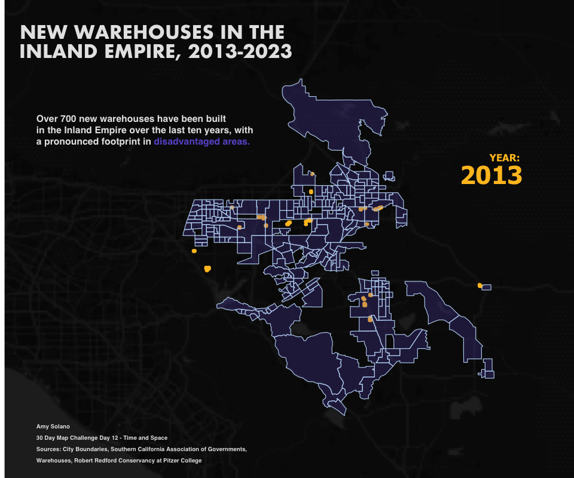

## Portfolio

---
### Category Name 1 

[Warehouse Map](https://github.com/solanoamy/30DayMap24/blob/main/scripts/12-amy.R)
This standalone map visualizes the increased footprint of warehouses in the Inland Empire over a ten-year period, highlighting their prevalence in disadvantaged areas. These disadvantaged areas are at increased risk of the harms of pollutants associated with the increased trucking in these areas, such as diesel particulate matter. 

---
[Project 2 Title](/pdf/sample_presentation.pdf)

---
[Project 3 Title](http://example.com/)

---

### Category Name 2

- [Project 1 Title](http://example.com/)
- [Project 2 Title](http://example.com/)
- [Project 3 Title](http://example.com/)
- [Project 4 Title](http://example.com/)
- [Project 5 Title](http://example.com/)

---
### News Articles and Reports

---
### Education

 - Master of Urban Spatial Analytics, University of Pennsylvania (2025)
 - Bachelor of Arts in Communication, University of Pennsylvania (2023)
---

### Awards

- [WTS Philadelphia Award to Chinatown Stitch](https://dvrpc.org/news/2024/chinatown-stitch-receives-wts-award/), Member of DVRPC Communications and Engagement team

---

Page template forked from <a href="https://github.com/evanca/quick-portfolio">evanca</a>

<!-- Remove above link if you don't want to attibute -->
